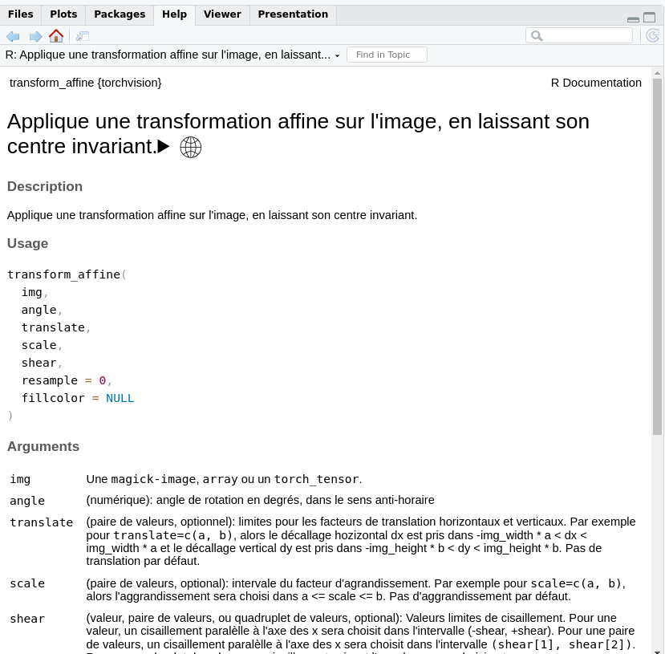

# torchvision.fr

<!-- badges: start -->

<!-- badges: end -->

Le paquet d'internationalisation de {torchvision} en français (fr_FR)

## Installation

Vous pouvez installer la version de development de {torchvision.fr} depuis [GitHub](https://github.com/) via:

``` r
# install.packages("devtools")
devtools::install_github("eliocamp/rhelpi18n")
devtools::install_github("cregouby/torchvision.fr")
```

## Exemple

Voici comment obtenir l'aide de {torchvision} en français :

``` r
# configure la session en langue française
Sys.setenv(LANGUAGE = "fr")

# charge la librairie de traduction puis torchvision par sa traduction française
library(torchvision.fr)

# consulte l'aide normalement
?transform_affine
```



